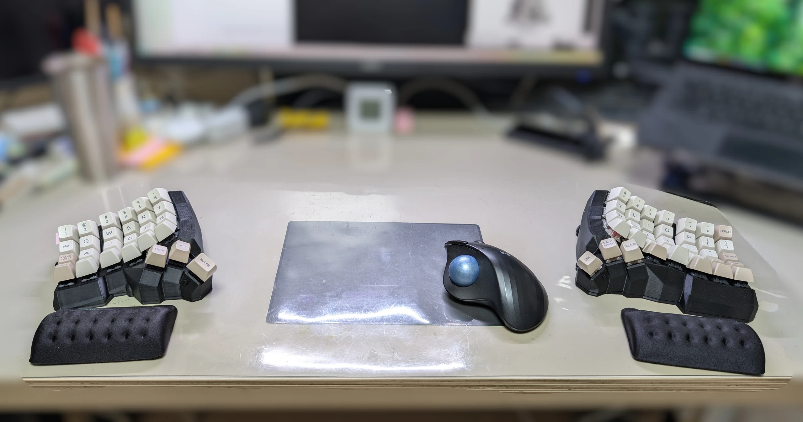
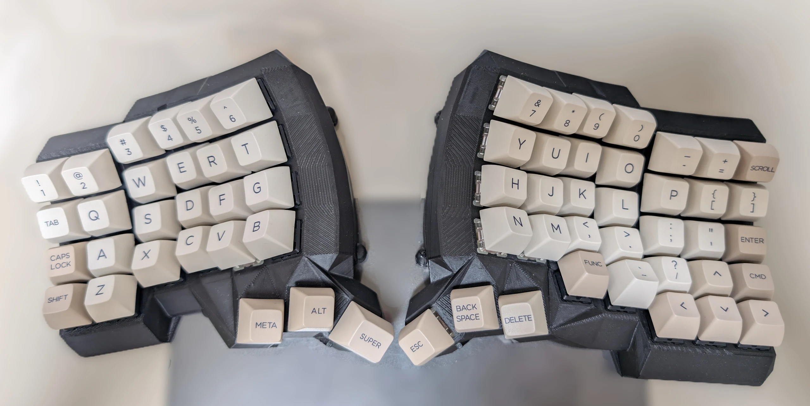
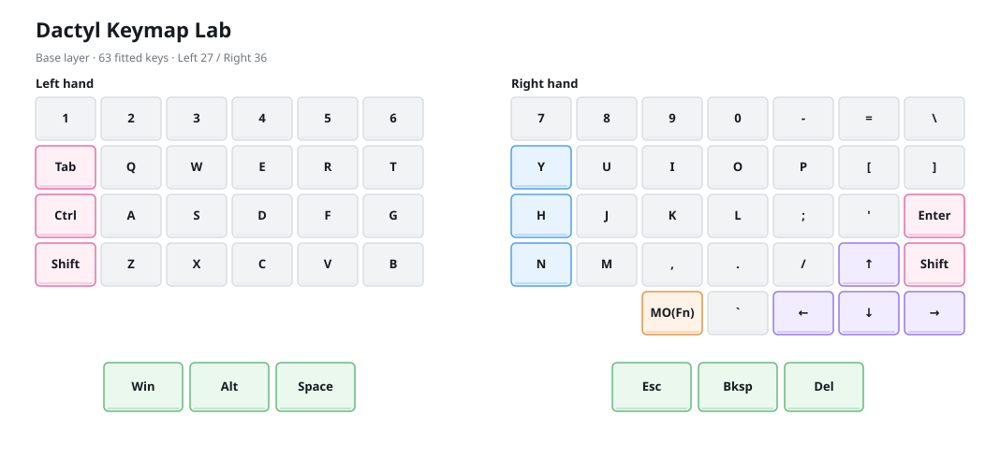
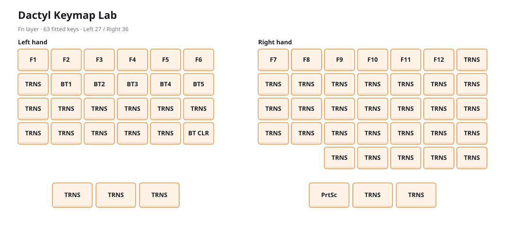
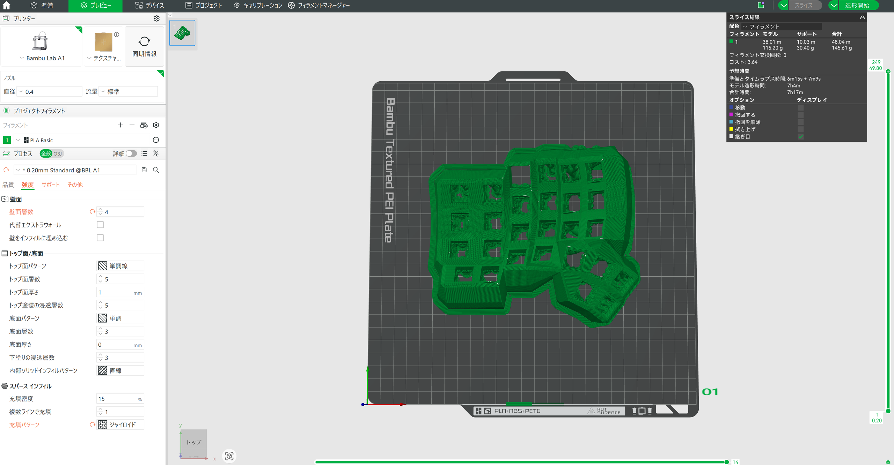
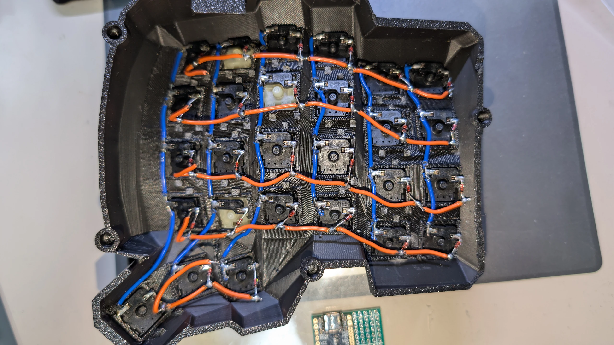
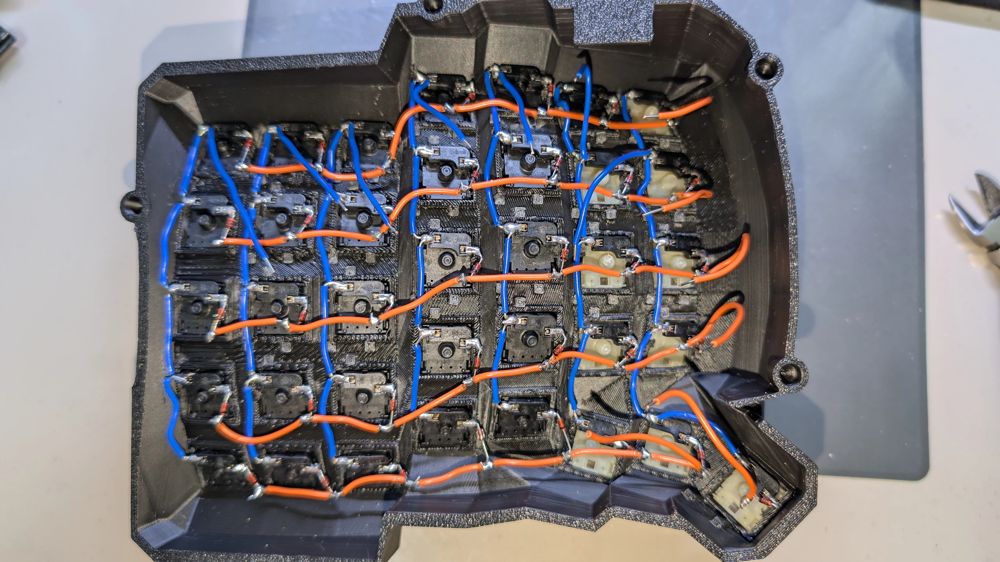
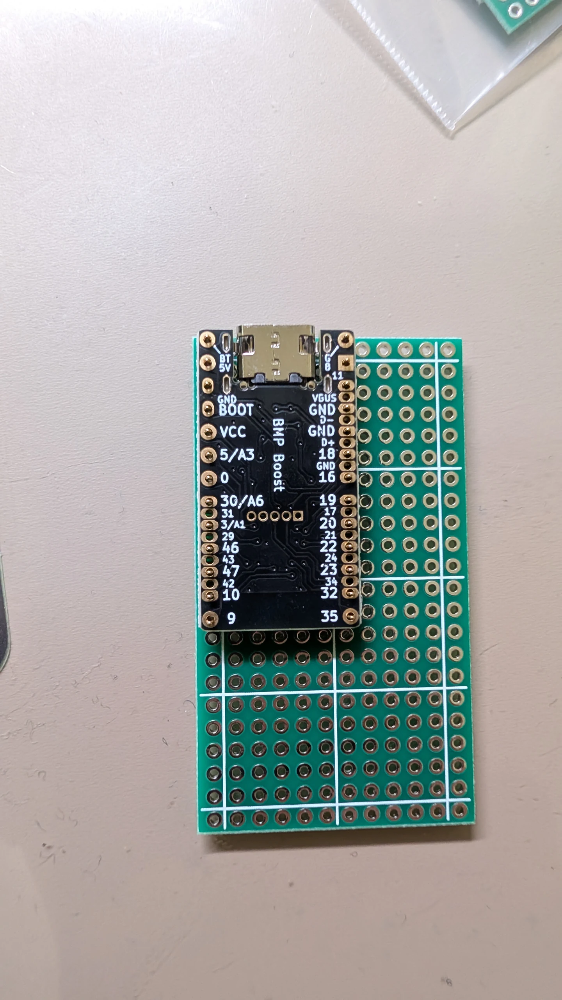
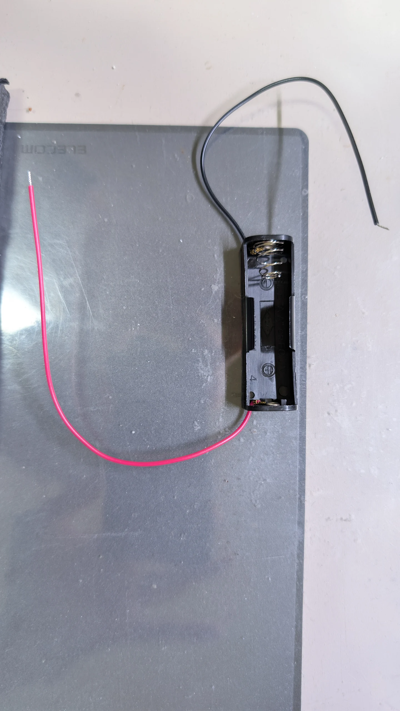
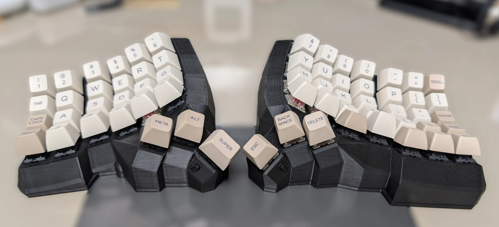

> **What I wanted from this keyboard**
> - A split keyboard
> - An ergonomic shape
> - Dedicated arrow keys
> - A layout that still feels familiar to someone used to a conventional 70% keyboard
> - No requirement for the two halves to be symmetrical
> - Bluetooth connectivity
> - Power from AA batteries

> **What I built**
> - An asymmetric Dactyl Manuform with 27 keys on the left and 36 on the right, for a total of 63 keys
> - One BMP Boost and one AA battery in each half, connected as a ZMK wireless split
> - No cable between the two halves, with Bluetooth connectivity to the PC

---

## Introduction

I had previously built several split keyboards, including the Iris and Choco60, and had also tried the off-the-shelf BAROCCO. None of them felt quite right, so I kept returning to a conventional keyboard layout. Most recently, I had been using a Realforce.

Through that trial and error, I realized that what I wanted was a keyboard that kept the arrow keys and a mostly familiar layout while combining a split design with an ergonomic shape. Buying a Bambu Lab A1 during an Amazon sale gave me the push I needed to build the enclosure as well as the electronics.

I chose the Dactyl Manuform as the basis for the shape. The finished layout is asymmetric, with 27 keys on the left and 36 on the right, including three thumb keys on each half. All of my previous split keyboards had been wired, but for this build I wanted to eliminate the interconnect cable. I therefore used BMP Boost controllers, which include boost converters, together with ZMK's wireless split support. I also used Claude and Codex as supporting tools while configuring and troubleshooting ZMK.

The result is an ergonomic split keyboard that meets nearly all of my requirements. Of everything I have tried, this feels the closest to an “endgame” keyboard and the most likely to stay on my desk for a long time. The main thing I might change is the height of the rightmost column, where the Enter key sits under my little finger.

This article documents the design, 3D printing, hand-wired matrix, power system, ZMK firmware, flashing process, and final testing.

## 1. Final Specifications

### 1.1 Final Configuration

| Item | Final build |
|---|---|
| Form | Split, columnar-curved, asymmetric Dactyl Manuform |
| Key count | 27 left + 36 right = 63 keys total |
| Left half | 4 rows × 6 columns + 3 thumb keys |
| Right half | 4 rows × 7 columns + 8 additional keys, including the thumb cluster, arrow keys, and Esc |
| Switches | MX-compatible, hand-wired |
| Diodes | 1N4148, one per key |
| Controllers | 2 × BMP Boost |
| Firmware | ZMK |
| Inter-half link | BLE wireless split |
| Host connection | Bluetooth from the left central half; USB when needed |
| Power | One AA battery per half |
| Power control | One physical power switch per half |
| Case | PLA, printed on a Bambu Lab A1 |
| Bottom plates | Separate PLA plates, approximately 3 mm thick |
| Interconnect cable | None |
| RGB / OLED | None |

### 1.2 Key Layout



#### Base Layer



#### Function Layer



- `BT1`–`BT5`: Select Bluetooth profile 1–5.
- `BT CLR`: Clear the stored pairing information for the currently selected profile.
- `TRNS`: Fall through to the key on the Base layer.

I created the diagrams above with [Dactyl Keymap Lab](https://negitorowarship.github.io/dactyl-keymap-lab/), a small tool I built, and then adjusted them to match the final physical layout.

#### Keycap Legends That Differ from Their Actual Actions

| Side | Legend | Actual action |
|---|---|---|
| Left | Caps Lock | Left Ctrl |
| Left | Meta | Windows / GUI |
| Left | Super | Space |
| Right | Scroll | Backslash; vertical bar with Shift |
| Right | Cmd | Right Shift |
| Right | Func | Momentarily activates the Function layer |

### 1.3 Wireless and Power Architecture

```text
PC / Bluetooth host
        <-> Bluetooth HID
Left half (central, BMP Boost, one AA battery)
        <-> ZMK BLE split
Right half (peripheral, BMP Boost, one AA battery)
```

- The two halves are powered independently; neither half supplies power to the other.
- Only the left central half is paired with the PC.
- The right peripheral half sends key events to the left half.
- USB-C is used for flashing firmware and testing USB operation. It does not charge the AA battery.

---

## 2. Parts and Tools

### 2.1 Main Parts Used in the Final Build

| Category | Part | Quantity | Notes |
|---|---|---:|---|
| Case | Left and right case bodies | 1 each | Printed from the final geometry for each half |
| Bottom plate | Left and right bottom plates | 1 each | Approximately 3 mm thick and matched to each case body |
| Controller | BMP Boost | 2 | Left central and right peripheral; purchased from Yushakobo |
| Spring-pin header | 13-pin Conthrough header | 2 | Makes each controller removable |
| Prototyping board | Universal prototyping board | 2 | Holds the wiring while the BMP Boost connects through the spring-pin headers |
| Switch | MX-compatible switch | 63 | Cherry MX Silent Pink |
| Switch socket | MX hot-swap socket | 63 | Used to make hand-wiring easier |
| Keycap | SA profile | 63 | Some legends differ from the actual key actions |
| Diode | 1N4148 | 63 | Directly wired |
| Wire | — | As needed | Purchased from Akizuki Denshi |
| Heat-shrink tubing | — | As needed | Purchased from Akizuki Denshi |
| Battery holder | Single-AA holder | 2 | Red is positive and black is negative; verified with a multimeter |
| Fastener | Neodymium magnet | 10 | Bonded with adhesive |

### 2.2 Tools

- Bambu Lab A1 with a 0.4 mm nozzle
- Bambu Studio
- Temperature-controlled soldering iron, solder, and desoldering braid
- Flush cutters, wire strippers, and tweezers
- Multimeter with continuity, diode, and voltage modes
- Hot glue gun

---

## 3. Case Design and 3D Printing

### 3.1 Model Data

I printed a separate case body and bottom plate for each half. Each case body integrates the switch plate, thumb cluster, and internal space for the controller and battery. The bottom plates are approximately 3 mm thick.

I generated the case geometry with the [Dactyl Keyboard Configurator](https://ryanis.cool/dactyl/#manuform). The original configurations are available below for anyone who wants to reproduce or modify the design.

- [Left-half configuration](https://ryanis.cool/dactyl/#manuform:CiQIBhAFGgp0aHJlZS1taW5pIgR6ZXJvKgJteDIGbm9ybWllOAASEAjGChCjBRjCAyADKMYKMAAaCQgAEgN1c2IYACIXVQAAEEEYACABXQAAYEBlAAAAQEAASAEy+QGVAwAAIECdAwAAgD+AAwGIAwENAAAAABUAAAAAHeF6NEAlAACQwC0AAEDBNeF6tEA9AAAAAEUAAAAATQAAwEBVAABAwF0AAOBAZTMzYcJtMzMtwnUAALzBeOcCgAHNGIgByCSVATMzF8KdATMzXcKlAWZmysGoAZ8LsAGZF7gB/CXFAQAATMLNAQAAyMHVAQAAQMHYAZwE4AHzF+gBkBz1AQAA6MH9AQAAIMKFAgAAUMGIApsEkALzF5gC4CGlAgAAAMKtAgAAcMG1AgAAAMC4AoQHwAKVEMgChAfVAgAAQMHdAgAAgMHlAgAAgL/oAoQH8AKVEPgChAcqBggAEAAYAA==)
- [Right-half configuration](https://ryanis.cool/dactyl/#manuform:CiQIBxAFGgp0aHJlZS1taW5pIgRmdWxsKgJteDIGbm9ybWllOAASEAjGChCjBRjCAyADKMYKMAAaCQgAEgN1c2IYACIXVQAAEEEYACABXQAAYEBlAAAAQEAASAEy+QGVAwAAIECdAwAAgD+AAwGIAwENAAAAABUAAAAAHeF6NEAlAACQwC0AAEDBNeF6tEA9AAAAAEUAAAAATQAAwEBVAABAwF0AAOBAZTMzYcJtMzMtwnUAALzBeOcCgAHNGIgByCSVATMzF8KdATMzXcKlAWZmysGoAZ8LsAGZF7gB/CXFAQAATMLNAQAAyMHVAQAAQMHYAZwE4AHzF+gBkBz1AQAA6MH9AQAAIMKFAgAAUMGIApsEkALzF5gC4CGlAgAAAMKtAgAAcMG1AgAAAMC4AoQHwAKVEMgChAfVAgAAQMHdAgAAgMHlAgAAgL/oAoQH8AKVEPgChAc=)

### 3.2 Material Selection

Before committing to the full print, I tested an MX-compatible switch in a 14.0 mm hole printed in PLA. Once I confirmed that the fit provided enough retention, I chose PLA for the case.

- PLA and ABS shrink differently, so the switch-hole dimensions would need to be verified again before changing materials.
- The Bambu Lab A1 is an open-frame printer. Printing a case of this size in ABS would introduce a greater risk of warping and poor interlayer adhesion.

On the final print, a few switch holes needed minor trimming with flush cutters, but the switches fit well overall.

### 3.3 Bambu Lab A1 Print Settings

Because a few holes still needed adjustment, these values should be treated as a starting point rather than a definitive profile.

| Setting | Value |
|---|---:|
| Printer | Bambu Lab A1 |
| Plate | Textured PEI Plate |
| Nozzle | 0.4 mm |
| Material | PLA Basic |
| Process | `0.20mm Standard @BBL A1` |
| Layer height | 0.20 mm |
| Initial layer height | 0.20 mm |
| Wall loops | 4 |
| Top shell layers | 5 |
| Top shell thickness | 1.0 mm |
| Bottom shell layers | 3 |
| Infill | 15%, Gyroid |
| Support | Tree (auto), build plate only |
| Support threshold angle | Start at 45° and adjust in Preview |
| Brim | Outer brim only, 5 mm |
| Skirt | 0 loops |
| Prime tower | Off |

### 3.4 Checking the Sliced Preview



> **Screenshot from the prototype stage**
> This preview shows a prototype case with a different layout from the final version, sliced at a 0.20 mm layer height.

### 3.5 Printing Procedure

1. Clean the Textured PEI Plate.
2. Load PLA Basic and confirm that the A1 is calibrated.
3. Import the case-body and bottom-plate models into Bambu Studio, then verify the left/right parts and their print orientations.
4. Slice using the settings above as a baseline. Move the layer slider from bottom to top and inspect the first layer, supports, switch holes, and any disconnected islands.
5. After printing begins, watch the first layer until the brim and the perimeter of the case are firmly attached.

### 3.6 Post-Processing

1. Wait for the build plate and printed parts to cool.
2. Remove the brim and supports carefully to avoid cracking the thin switch plate.
3. Before trimming any holes, insert one of the intended MX switches and check the retention force.
4. Confirm that the switch can be inserted without tools, its retention tabs spring back into place, and the case does not show stress whitening.
5. Check the position and polarity of the neodymium magnets, then bond them into the bottom-plate mounts.
6. Temporarily install all switches and check for interference between adjacent keycaps.

---

## 4. Hand-Wiring the Key Matrix

### 4.1 Electrical Path Through One Key

The final matrix uses `col2row` diode orientation on both halves.

```text
Column / blue -> MX switch -> 1N4148 diode (anode to cathode) -> Row / orange
```

- Blue wire: Connect the switch terminals without diodes along each column.
- Orange wire: Connect the banded sides of the diodes along each row.
- The band on a 1N4148 marks the cathode, which faces the Row side.

> **Strain relief and insulation**
> Recheck the solder volume, exposed conductors, and wire retention at every joint. Insulate any point that could touch an adjacent terminal, and secure the wiring so that pulling on a wire does not place force directly on a diode lead.

### 4.2 Left Matrix: 5 Rows × 6 Columns, 27 Keys

The 24-key main section uses `R0–R3 / C0–C5`. The three thumb keys use `R4/C3–C5`.

| Physical signal | BMP Boost silkscreen label |
|---|---|
| C0 | 5/A3 |
| C1 | 0 |
| C2 | 30/A6 |
| C3 | 3/A1 |
| C4 | 46 |
| C5 | 47 |
| R0 | 19 |
| R1 | 20 |
| R2 | 22 |
| R3 | 23 |
| R4 | 32 |



### 4.3 Right Matrix: 6 Rows × 7 Columns, 36 Keys

The 28-key main section uses `R0–R3 / C0–C6`. The additional keys use `R4/C0–C6` for seven keys and `R5/C0` for Esc.

These Row / Column labels describe electrical coordinates, not the visual groups in the finished layout. Bksp and Del are physically part of the thumb cluster, but electrically they are connected to R4.

Column connections:

| Physical signal | BMP Boost silkscreen label |
|---|---|
| C0 | 5/A3 |
| C1 | 0 |
| C2 | 30/A6 |
| C3 | 3/A1 |
| C4 | 46 |
| C5 | 47 |
| C6 | 10 |

Row connections:

| Physical signal | BMP Boost silkscreen label |
|---|---|
| R0 | 35 |
| R1 | 32 |
| R2 | 23 |
| R3 | 22 |
| R4 | 20 |
| R5 | 19 |



### 4.4 Wiring Procedure

1. Install all switches in the cases.
2. Orient every diode so that its band faces the Row side.
3. Wire a single key first and verify the diode direction with the multimeter's diode mode.
4. Use blue wire to connect each Column vertically.
5. Use orange wire to connect the banded sides of the diodes along each Row.
6. Route the thumb cluster and the additional right-hand keys using their assigned nets.
7. Run one lead from each Row and Column to the BMP Boost.
8. Label each lead, for example `R0` or `C0`.
9. Before connecting the BMP Boost, test every key for continuity, diode direction, and shorts to neighboring nets.
10. After connecting the controller, add strain relief to the wire bundle and board.

### 4.5 Checks Before Applying Power

- With a switch released, there should be no continuity in either direction between its Row and Column.
- With a switch pressed, the meter should show a reading only in the diode's forward direction.
- There should be no continuity to neighboring Rows or Columns.
- There should be no continuity between the power wiring and the matrix wiring.
- No exposed conductor should be able to touch the bottom plate or an adjacent terminal.

---

## 5. Connecting the BMP Boost and AA Battery

### 5.1 BMP Boost Orientation

While working, I read the pin labels with USB-C at the top and the silkscreen side facing me. In the completed build, a universal prototyping board serves as a support and wiring base.



I used the [official BMP Boost documentation](https://github.com/sekigon-gonnoc/BLE-Micro-Pro/blob/master/bmp-boost/README.md) as the pinout reference.

### 5.2 AA Battery Connection

```text
AA holder + (red) -> physical power switch -> BMP Boost BT
AA holder - (black) ------------------------> BMP Boost G
```



> **Do not connect the battery here**
> Do not connect the AA battery to `5V`, `VCC`, or the USB-side `VBUS`. In this build, battery positive connects to `BT` and battery negative connects to `G`. Do not use USB-C as a charger for a Ni-MH cell.

### 5.3 First Power-On

1. Disconnect USB and remove all batteries.
2. Insert a battery in the holder and confirm a positive voltage from the red lead to the black lead.
3. Remove the battery again.
4. Solder the red lead to `BT` through the physical power switch, and solder the black lead to `G`.
5. With no battery installed, verify that `BT–G` is not a persistent short.
6. Test the BMP Boost and key matrix using USB power only.
7. Disconnect USB and install a battery in one half only.
8. Check for reversed voltage, 0 V, abnormal heat, or unusual odors.
9. If everything is normal, repeat the process for the other half.

---

## 6. ZMK Firmware

### 6.1 Repository Structure

The firmware configuration and build environment are available on GitHub:

- [NegitoroWarship/my_dactyl](https://github.com/NegitoroWarship/my_dactyl)

The main files are:

| File | Purpose |
|---|---|
| `firmware/build.yaml` | Build targets for both halves, `settings_reset`, and diagnostic firmware |
| `firmware/config/west.yml` | Retrieves ZMK and the BMP Boost component |
| `firmware/boards/shields/sakoa_dactyl/sakoa_dactyl.dtsi` | Defines the 63-key matrix transform that combines both halves |
| `.../sakoa_dactyl_left.overlay` | GPIO definitions for the 5 × 6 left matrix |
| `.../sakoa_dactyl_right.overlay` | GPIO definitions and column offset for the 6 × 7 right matrix |
| `.../sakoa_dactyl.keymap` | Base and Function layers |
| `.../sakoa_dactyl_left.conf` | Power-saving settings for the left half |
| `.../sakoa_dactyl_right.conf` | Power-saving settings for the right half |

### 6.2 Roles of the Two Halves

- `sakoa_dactyl_left`: central, 5 rows × 6 columns.
- `sakoa_dactyl_right`: peripheral, 6 rows × 7 columns.
- The right half uses `col-offset = 6` so that its global columns begin after the six columns on the left.
- Both halves use `diode-direction = "col2row"`.
- `wakeup-source` allows a key press to wake the keyboard from deep sleep.

### 6.3 Function Layer

| Input | Result |
|---|---|
| `Fn+1` through `Fn+0` | F1 through F10 |
| `Fn+-` / `Fn+=` | F11 / F12 |
| `Fn+Esc` | Print Screen |
| `Fn+Q/W/E/R/T` | Select Bluetooth profile 1–5 |
| `Fn+B` | Clear pairing information for the selected profile |

Keys not explicitly assigned on the Function layer are transparent and behave as they do on the Base layer.

### 6.4 Power-Saving Settings

I settled on the following configuration for both halves:

```ini
CONFIG_ZMK_KSCAN_MATRIX_POLLING=n
CONFIG_ZMK_SLEEP=y
CONFIG_ZMK_IDLE_SLEEP_TIMEOUT=3600000
```

- Use interrupt-driven matrix scanning rather than polling.
- Enter deep sleep after one hour of inactivity.
- Reconnecting over Bluetooth after wake-up may take a moment.

### 6.5 Firmware Evolution

| Commit | Change |
|---|---|
| `682bc18` | Added the Sakoa Dactyl firmware for BMP Boost |
| `5ec6d9c` | Added direct-GPIO matrix diagnostics |
| `50fd310` | Added the official Pro Micro pin tester |
| `994a1ee` through `c030854` | Added USB, GPIO, and HID diagnostics incrementally |
| `41e9abb` | Corrected the reversed physical row order on the right half |
| `d627289` | Enabled battery-oriented matrix scanning and sleep |
| `8464204` | Added five Bluetooth host profiles |
| `7974f0d` | Extended the deep-sleep timeout to one hour |
| `4f95456` | Recorded the final key layout in the README |

---

## 7. Flashing the Firmware

### 7.1 UF2 Files

For normal use, the GitHub Actions build artifacts provide these three UF2 files:

- `settings_reset-bmp_boost-zmk.uf2`
- `sakoa_dactyl_right-bmp_boost-zmk.uf2`
- `sakoa_dactyl_left-bmp_boost-zmk.uf2`

`tester_pro_micro`, `sakoa_gpio_logger`, and `sakoa_usb_auto_test` are diagnostic builds. Do not confuse them with the normal left- and right-half firmware.

### 7.2 Entering the Bootloader

1. Remove the battery or turn the physical power switch off.
2. Connect only one half to USB at a time.
3. Temporarily short `BOOT` to `GND` on the BMP Boost with tweezers.
4. Keep the pins shorted while plugging in USB-C.
5. When the UF2 drive appears, remove the tweezers.

### 7.3 First-Time Setup or Re-Pairing the Two Halves

```text
Flash settings_reset to left
  -> Flash settings_reset to right
  -> Flash right UF2
  -> Flash left UF2
  -> Power on right, then left
  -> Pair the PC with the left half
```

1. Flash `settings_reset` to the left half.
2. Flash `settings_reset` to the right half.
3. Flash the right-half UF2.
4. Flash the left-half UF2.
5. Power on the right half first, followed by the left half.
6. If the PC has an older device with the same name, remove it.
7. Pair the PC with the left central half over Bluetooth.
8. Test every key on both halves.

Windows may display a warning after copying a UF2 file even when flashing succeeded. If the drive disappears automatically and the controller reboots, verify the installed firmware and its behavior before treating the warning as a failure.

---

## 8. Testing and Troubleshooting

### 8.1 Test in Stages

1. **One half over USB, no battery:** Confirm that the controller starts.
2. **GPIO diagnostics:** Confirm that each physical Row and Column reaches the expected pin.
3. **One-half key matrix:** Confirm that every key reports the correct coordinate.
4. **Both halves powered by USB:** Confirm that the wireless split link works.
5. **Battery power:** Confirm that both halves start without USB.
6. **Bluetooth:** Confirm that the left central half connects to the PC.
7. **Power saving:** Confirm that the keyboard sleeps after one hour and wakes on a key press.

### 8.2 Where to Look First

| Symptom | Check first |
|---|---|
| One key does not respond | Switch terminals, diode orientation, and the two solder joints for that key |
| An entire column does not respond | Blue Column wire, BMP Boost Column pin, and the overlay |
| An entire row does not respond | Orange Row wire, BMP Boost Row pin, and the overlay |
| A key responds on the wrong row | Physical Row order and the `row-gpios` order in the overlay |
| The left half works, but the entire right half does not | Right-half power, right UF2, `settings_reset` on both halves, and the BLE split link |
| The keyboard works over USB but not from the batteries | `BT` / `G` polarity, physical power switch, and battery voltage |
| The keyboard does not appear as a Bluetooth device | Left central power, stale bonding information, and the selected Bluetooth profile |
| The keyboard does not wake from sleep | `wakeup-source`, interrupt-driven scanning, and the matrix state during a key press |
| Extra keys appear without being pressed | Solder bridges, exposed conductors, and shorts between Rows and Columns |

---

## 9. Finished Build



The finished keyboard meets the original goals: an asymmetric 63-key layout, a fully wireless split, and AA-battery power. I still see room to improve the position of the Enter key on the rightmost column, but of all the split keyboards I have tried, this is the one that feels most likely to remain in long-term use.
